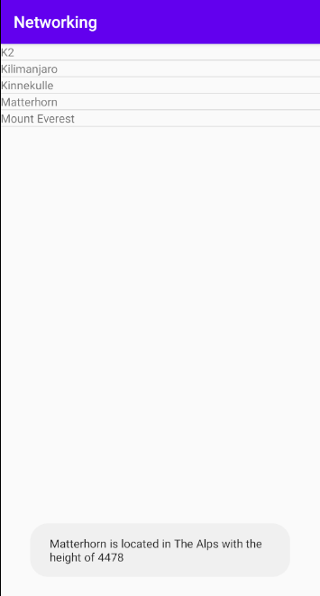

# Rapport

Jag skapade en listview i `activity_main.xml` och gav den ett ID.

Sedan skapade jag en arrayadapter samt en arraylist som syns i kodsnutten nedan.

```java
private ArrayAdapter<Mountain> mountainAdapter;
private ArrayList<Mountain> mountainList = new ArrayList<>();
```

Sedan initialiserade jag min listview och skickade med min adapter till den. För att få min adapter att fungera var jag tvungen att skicka med en layout som adapten använder sig av för att senare visa mina objekt i, jag fastnade vid denna punkten men kom snabbt på banan igen efter jag skapade `list_items.xml` som endast innehåller en TextView och skickade med den med min adapter. Detta visas i koden nedan.

```java
mountainAdapter = new ArrayAdapter<>(this, R.layout.list_items,mountainList);
ListView list = (ListView) findViewById(R.id.mylistview);
list.setAdapter(mountainAdapter);
```

Efter detta importerade jag nätverkskoden som vi skulle använda till uppgiften. Jag la till gson biblioteket för användning i projektet och sedan skapade jag koden för använda mig utav JSON data med hjälp utav gson. I samband med detta skapade jag även Mountain klassen och gjorde en egen konstruktor då jag tyckte det var lättare att hålla reda på vad mina objekt och array innehåller. Detta visas i koden nedan.

```java
        Gson gson = new Gson();
        Mountain[] mountains;
        mountains = gson.fromJson(json,Mountain[].class);
        mountainAdapter.clear();
        for (int i=0; i < mountains.length; i++)
        {
            mountainList.add(new Mountain(mountains[i].toString(), mountains[i].getLocation(), mountains[i].getHeight()));
        }
        mountainAdapter.notifyDataSetChanged();
```

Efter testning vid detta laget kunde jag få upp bergnamn i en lista vilket var ett eureka moment för mig. Då började jag med att skapa min toast. Detta var rätt så simpelt med en onItemClickListener och en onItemClick metod för att få det fungera. Min toast är simpel men får ut den information jag ville. Koden nedan visar hur jag gjorde detta.

```java
        list.setOnItemClickListener(new AdapterView.OnItemClickListener(){
            @Override
            public void onItemClick(AdapterView<?> parent, View view, int position, long id){
                String m = mountainList.get(position) + " is located in " + mountainList.get(position).getLocation() + " with the height of " + mountainList.get(position).getHeight();
                Toast.makeText(MainActivity.this, m, Toast.LENGTH_SHORT).show();
            }
        });
```

Efter detta fungerade allt som det ska. Denna uppgiften var onekligen svårare än de förra och jag fick lägga mer tid än förväntat men till slut fick jag det att fungera. Nedan är en bild på hur appen ser ut inklusive toast meddelandet.

